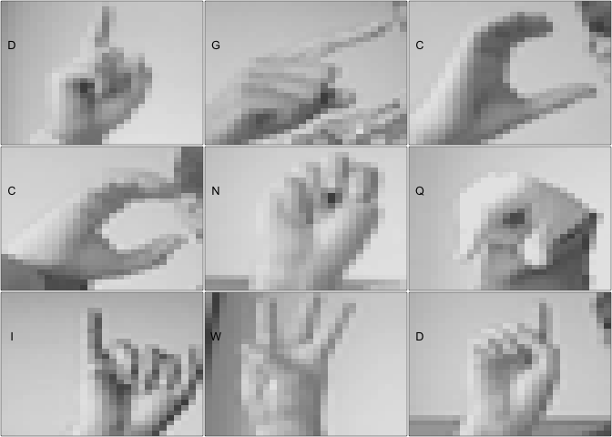
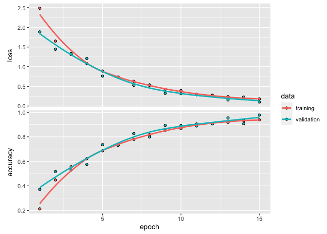
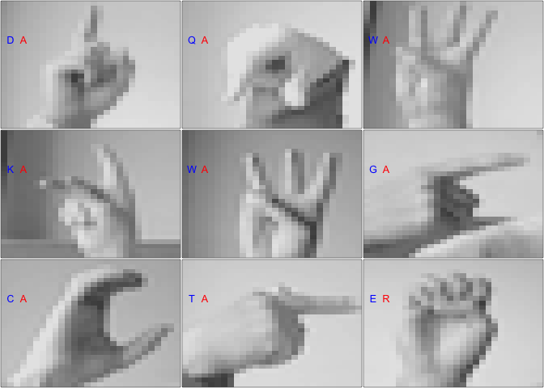

# _Sign Language Recognizer_

Kali ini, kita akan membuat _Sign Language recognizer_ menggunakan metode _Machine Learning_ bernama Neural Network. 

Kita akan menggunakan dataset MNIST, yakni data berisi ribuan gambar bahasa isyarat atau _Sign Language_ dari berbagai jenis tangan. Kita akan membuat sebuah model Machine Learning yang nantinya dapat mengenali bahasa isyarat dari A sampai Z dengan belajar dari informasi yang diberikan.

## Import Data


```r
sign <- read.csv("data/sign_mnist_train.csv")
```

## Exploratory Data Analytics (EDA)


```r
head(sign)[,1:9]
```

```
##   label pixel1 pixel2 pixel3 pixel4 pixel5 pixel6 pixel7 pixel8
## 1     3    107    118    127    134    139    143    146    150
## 2     6    155    157    156    156    156    157    156    158
## 3     2    187    188    188    187    187    186    187    188
## 4     2    211    211    212    212    211    210    211    210
## 5    13    164    167    170    172    176    179    180    184
## 6    16    161    168    172    173    178    184    189    193
```


```r
dim(sign)
```

```
## [1] 27455   785
```


Dari data diatas, bisa dilihat total column berjumlah sebanyak 785. Yang terdiri dari satu label dan 784 pixel atau gambar (28x28).

Pada kolom label diatas terdiri dari 0-25, yang memiliki arti

0 = A  
1 = B  
2 = C  
3 = D  
4 = E  
5 = F  
6 = G  
7 = H  
8 = I  
9 = J  
10 = K  
11 = L  
12 = M  
13 = N  
14 = O  
15 = P  
16 = Q  
17 = R  
18 = S  
19 = T  
20 = U  
21 = V  
22 = W  
23 = X  
24 = Y  
25 = Z  

Karena `label` target terdiri dari angka, mari kita buat kamus untuk mengubahnya menjadi arti sebenarnya yaitu Huruf A-Z.


```r
label_mapping <- c(
  "0" = "A",
  "1" = "B",
  "2" = "C",
  "3" = "D",
  "4" = "E",
  "5" = "F",
  "6" = "G",
  "7" = "H",
  "8" = "I",
  "9" = "J",
  "10" = "K",
  "11" = "L",
  "12" = "M",
  "13" = "N",
  "14" = "O",
  "15" = "P",
  "16" = "Q",
  "17" = "R",
  "18" = "S",
  "19" = "T",
  "20" = "U",
  "21" = "V",
  "22" = "W",
  "23" = "X",
  "24" = "Y",
  "25" = "Z"
)
```


Jika divisualisasikan data kita akan berbentuk seperti berikut.


```r
vizTrain(
  sign %>% 
    head(9) %>% 
    mutate(
      label = label_mapping[as.character(label)] %>% 
        as.vector()
    )
)
```

<!-- -->

## Data Preprocessing

### Data labeling

Target pada data dilabel menggunakan angka, agar mempermudah untuk menginterpretasi dan membaca hasil prediksi. Marilah kita melabel data target.


```r
sign <- sign %>% 
  mutate(
    label_char = label_mapping[as.character(label)] %>% 
      as.vector() %>% 
      as.factor()
  )
```


```r
sign %>% 
  head() %>% 
  select(label, label_char)
```

```
##   label label_char
## 1     3          D
## 2     6          G
## 3     2          C
## 4     2          C
## 5    13          N
## 6    16          Q
```

### Check data distribution


```r
prop.table(table(sign$label_char))
```

```
## 
##          A          B          C          D          E          F          G 
## 0.04101257 0.03678747 0.04166818 0.04356219 0.03485704 0.04385358 0.03970133 
##          H          I          K          L          M          N          O 
## 0.03689674 0.04232380 0.04057549 0.04520124 0.03842652 0.04192315 0.04356219 
##          P          Q          R          S          T          U          V 
## 0.03962848 0.04658532 0.04713167 0.04367146 0.04319796 0.04228738 0.03940994 
##          W          X          Y 
## 0.04461847 0.04239665 0.04072118
```

Jika dilihat dari distribusi data target, proporsi per category sekitar 0.4 yang berarti cukup seimbang.

### Cross validation

Selanjutnya kita akan membagi data kita menjadi 80% data _train_ dan 20% data _test_.


```r
set.seed(123)
idx <- sample(nrow(sign), nrow(sign)*0.8)
sign.train <- sign[idx,]
sign.test <- sign[-idx,]
```

### Data preperation

Sebelum membuat model, ada beberapa hal yang perlu dilakukan untuk mempersiapkan data:

1. Memisahkan prediktor dengan target variabel
2. Mengubah prediktor menjadi matrix/array
3. Melakukan one-hot encoding apabila target variabel adalah kategori

Karena prediktornya adalah nilai kecerahan dari tiap pixel, kita tahu bahwa range nilainya bisa antara 0 hingga 255. Setiap pixel akan di-scaling dengan membagi nilai pixel terhadap 255. Setelah di-scaling, tiap kolom prediktor akan memiliki range antara 0-1.


```r
target <- c("label", "label_char")
```


```r
sign.train.x.keras <- sign.train %>% 
  select(-target) %>%
  as.matrix() / 255
```

```
## Note: Using an external vector in selections is ambiguous.
## ℹ Use `all_of(target)` instead of `target` to silence this message.
## ℹ See <https://tidyselect.r-lib.org/reference/faq-external-vector.html>.
## This message is displayed once per session.
```

```r
sign.train.x.keras <- array_reshape(
  x=sign.train.x.keras,
  dim = dim(sign.train.x.keras)
)
sign.test.x.keras <- sign.test %>% 
  select(-target) %>% 
  as.matrix() / 255
sign.test.x.keras <- array_reshape(
  x=sign.test.x.keras,
  dim = dim(sign.test.x.keras)
)

sign.train.y.keras <- sign.train$label
sign.test.y.keras <- sign.test %>% 
  select(label, label_char)

sign.train.y.keras <- to_categorical(
  y=sign.train.y.keras,
  num_classes=dim(sign.train.y.keras)
)
```

## Build Model

### Create Neural Network Architecture

Langkah selanjutnya adalah membangun arsitektur Neural Network. Beberapa ketentuan ketika membuat arsitektur Neural Network:

1. Selalu diawali `keras_model_sequential()`
2. Layer pertama yang dibuat akan menjadi hidden layer pertama
3. Input layer dibuat dengan memasukkan parameter `input_shape` pada layer pertama
4. Layer terakhir yang dibuat akan menjadi output layer


```r
tensorflow::tf$random$set_seed(123)

inputshape <- ncol(sign.train.x.keras)
outputshape <- ncol(sign.train.y.keras)

model <- keras_model_sequential(name="model-sign") %>% 
  layer_dense(
    units=128,
    input_shape = inputshape,
    activation = "relu",
    name="hidden-1"
  ) %>%
  layer_dense(
    units=64,
    activation = "relu",
    name="hidden-2"
  ) %>% 
  layer_dense(
    units=32,
    activation = "relu",
    name="hidden-3"
  ) %>% 
  layer_dense(
    units=16,
    activation = "relu",
    name="hidden-4"
  ) %>% 
  layer_dense(
    units=outputshape,
    activation = "softmax",
    name="output-1"
  )
```

### Compile model

Langkah berikutnya adalah menentukan error function, optimizer, dan metrics yang akan ditunjukkan selama training.

Kita akan menggunakan
loss = `categorical_crossentropy`
optimizer = `adam`
learning rate = `0.001`
metrics = `accuracy`


```r
model %>% 
  compile(
    loss = "categorical_crossentropy",
    optimizer=optimizer_adam(lr=0.001),
    metrics="accuracy"
  )
```

### Train model

Dan tidak kalah penting, kita harus melatih model dengan data train yang telah dipersiapkan.
Model kita akan ditrain menggunakan `epochs` sebesar `15`, `batch_size` sebesar `32` dan `validation_split` sebesar `0.1`

```
hist <- model %>% 
  fit(
    x=sign.train.x.keras,
    y=sign.train.y.keras,
    epochs=15,
    batch_size=16,
    validation_split=0.1
  )

saveRDS(hist, "model.RDS")
```


```r
hist <- readRDS("model.RDS")

plot(hist)
```

```
## `geom_smooth()` using formula 'y ~ x'
```

<!-- -->

## Validate Model

Setelah membuat model, langkah terakhir adalah memvalidasi modelnya.

### Predict

Pertama, marilah kita buat prediksi dari data test menggunakan model yang baru kita buat.


```r
result <- predict_classes(model, sign.test.x.keras)

result <- label_mapping[as.character(result)] %>% 
  as.vector() %>% 
  as.factor()
```

### Confusion Matrix

Selanjutnya marilah kita mengetest ke akurasi hasil prediksi data test kita menggunakan confusion matrix.


```r
confusionMatrix(result, sign.test.y.keras$label_char)
```

```
## Warning in confusionMatrix.default(result, sign.test.y.keras$label_char): Levels
## are not in the same order for reference and data. Refactoring data to match.
```

```
## Confusion Matrix and Statistics
## 
##           Reference
## Prediction   A   B   C   D   E   F   G   H   I   K   L   M   N   O   P   Q   R
##          A 194 203 170 226 120 207 158 145 209 191 210 162 165 212 150 214 254
##          B   0   0   0   0   0   0   0   0   0   0   0   0   0   0   0   0   0
##          C   0   0   0   0   0   0   0   0   0   0   0   0   0   0   0   0   0
##          D   0   0   0   0   0   0   0   0   0   0   0   0   0   0   0   0   0
##          E   7   0   5   0  47   0   1   0   8  16   0  34  39   4  28  48   8
##          F   0   0   0   0   0   0   0   0   0   0   0   0   0   2   0   0   0
##          G   0   0   0   0   0   0   0   0   0   0   0   0   0   0   0   0   0
##          H   0   0   0   0   0   0   0   0   0   0   0   0   0   0   0   0   0
##          I   0   0   0   0   0   0   0   0   0   0   0   0   0   0   0   0   0
##          K   0   0   0   0   0   0   0   0   0   0   0   0   0   0   0   0   0
##          L   0   0   0   0   0   0   0   0   3   0   0   0   0   0   0   0   0
##          M   0   0   0   0   0   0   0   0   0   0   0   0   0   0   0   0   0
##          N   0   0   0   0   0   0   0   0   0   0   0   0   0   0   0   0   0
##          O   0   0   0   0   0   0   0   0   0   0   0   0   0   0   0   0   0
##          P   0   0   0   0   0   0   0   0   0   0   0   0   0   0   0   0   0
##          Q   0   0   0   0   0   0   0   0   0   0   0   0   0   0   0   0   0
##          R  27   0  17   0  20   5  12   8   1   0   1  21  30   8  22   7   5
##          S   0   0   0   0   0   0   0   0   0   0   0   0   0   0   0   0   0
##          T   0   0   0   0   0   0   0   0   0   0   0   0   0   0   0   0   0
##          U   0   0   0   0   0   0   0   0   0   0   0   0   0   0   0   0   0
##          V   0   0   0   0   0   0   0   0   0   0   0   0   0   0   0   0   0
##          W   0   0   0   0   0   0   0   0   0   0   0   0   0   0   0   0   0
##          X   0   0  27   0   0  28  48  61   9  12  25   2   1  22  14   7   0
##          Y   0   0   0   0   0   0   0   0   0   0   0   0   0   0   0   0   0
##           Reference
## Prediction   S   T   U   V   W   X   Y
##          A 223 221 221 188 254 226 205
##          B   0   0   0   0   0   0   0
##          C   0   0   0   0   0   0   0
##          D   0   0   0   0   0   0   0
##          E   1   0   5   0   1   0   0
##          F   0   0   0   0   0   0   0
##          G   0   0   0   0   0   0   0
##          H   0   0   0   0   0   0   0
##          I   0   0   0   0   0   0   0
##          K   0   0   0   0   0   0   0
##          L   1   0   0   0   0   0   0
##          M   0   0   0   0   0   0   0
##          N   0   0   0   0   0   0   0
##          O   0   0   0   0   0   0   0
##          P   0   0   0   0   0   0   0
##          Q   0   0   0   0   0   0   0
##          R   6   4   2   2   3   5   4
##          S   0   0   0   0   0   0   0
##          T   0   0   0   0   0   0   0
##          U   0   0   0   0   0   0   0
##          V   0   0   0   0   0   0   0
##          W   0   0   0   0   0   0   0
##          X  12   3   1   7   7   3   6
##          Y   0   0   0   0   0   0   0
## 
## Overall Statistics
##                                         
##                Accuracy : 0.0453        
##                  95% CI : (0.04, 0.0512)
##     No Information Rate : 0.0503        
##     P-Value [Acc > NIR] : 0.957         
##                                         
##                   Kappa : 0.004         
##                                         
##  Mcnemar's Test P-Value : NA            
## 
## Statistics by Class:
## 
##                      Class: A Class: B Class: C Class: D Class: E  Class: F
## Sensitivity           0.85088  0.00000  0.00000  0.00000 0.251337 0.0000000
## Specificity           0.13851  1.00000  1.00000  1.00000 0.961350 0.9996191
## Pos Pred Value        0.04103      NaN      NaN      NaN 0.186508 0.0000000
## Neg Pred Value        0.95544  0.96303  0.96012  0.95884 0.973277 0.9562762
## Prevalence            0.04152  0.03697  0.03988  0.04116 0.034056 0.0437079
## Detection Rate        0.03533  0.00000  0.00000  0.00000 0.008559 0.0000000
## Detection Prevalence  0.86105  0.00000  0.00000  0.00000 0.045893 0.0003642
## Balanced Accuracy     0.49470  0.50000  0.50000  0.50000 0.606343 0.4998096
##                      Class: G Class: H Class: I Class: K  Class: L Class: M
## Sensitivity           0.00000  0.00000  0.00000  0.00000 0.0000000  0.00000
## Specificity           1.00000  1.00000  1.00000  1.00000 0.9992388  1.00000
## Pos Pred Value            NaN      NaN      NaN      NaN 0.0000000      NaN
## Neg Pred Value        0.96012  0.96103  0.95811  0.96012 0.9569892  0.96012
## Prevalence            0.03988  0.03897  0.04189  0.03988 0.0429794  0.03988
## Detection Rate        0.00000  0.00000  0.00000  0.00000 0.0000000  0.00000
## Detection Prevalence  0.00000  0.00000  0.00000  0.00000 0.0007285  0.00000
## Balanced Accuracy     0.50000  0.50000  0.50000  0.50000 0.4996194  0.50000
##                      Class: N Class: O Class: P Class: Q  Class: R Class: S
## Sensitivity            0.0000  0.00000  0.00000  0.00000 0.0187266  0.00000
## Specificity            1.0000  1.00000  1.00000  1.00000 0.9607580  1.00000
## Pos Pred Value            NaN      NaN      NaN      NaN 0.0238095      NaN
## Neg Pred Value         0.9572  0.95484  0.96103  0.94974 0.9503882  0.95575
## Prevalence             0.0428  0.04516  0.03897  0.05026 0.0486250  0.04425
## Detection Rate         0.0000  0.00000  0.00000  0.00000 0.0009106  0.00000
## Detection Prevalence   0.0000  0.00000  0.00000  0.00000 0.0382444  0.00000
## Balanced Accuracy      0.5000  0.50000  0.50000  0.50000 0.4897423  0.50000
##                      Class: T Class: U Class: V Class: W  Class: X Class: Y
## Sensitivity           0.00000   0.0000  0.00000  0.00000 0.0128205  0.00000
## Specificity           1.00000   1.0000  1.00000  1.00000 0.9444550  1.00000
## Pos Pred Value            NaN      NaN      NaN      NaN 0.0101695      NaN
## Neg Pred Value        0.95848   0.9583  0.96412  0.95174 0.9555427  0.96085
## Prevalence            0.04152   0.0417  0.03588  0.04826 0.0426152  0.03915
## Detection Rate        0.00000   0.0000  0.00000  0.00000 0.0005463  0.00000
## Detection Prevalence  0.00000   0.0000  0.00000  0.00000 0.0537243  0.00000
## Balanced Accuracy     0.50000   0.5000  0.50000  0.50000 0.4786378  0.50000
```

Jika dilihat dari confussion matrix diatas, model kita mendapat 0.9752 yang artinya mendapat akurasi sebesar 97.52% atau sangat akurat.

### False Prediciton

Berikut beberapa prediksi yang salah.


```r
result.false <- sign.test %>% 
  mutate(
    label_pred = result,
  ) %>% 
  filter(as.character(label_pred) != as.character(label_char)) %>% 
  head(9)

vizTest(result.false)
```

<!-- -->

## Conclusion

Dalam memprediksi bahasa isyarat, model _Neural Network_ sangatlah cocok. Dan mendapatkan akurasi sebesar 97.52%.
